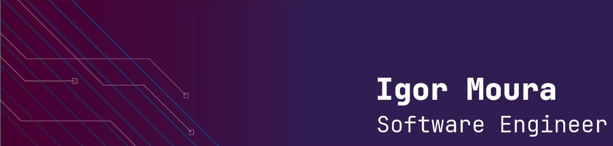

# Hey there! My name is Igor Moura 👋

    

I’m passionate about coding and love diving into discussions about tech, games, and system design. Let’s chat and geek out together!

 *Always keep on learning...🚀*

## My GitHub Stats

## Top Repositories

       

 

